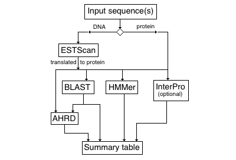

<!-- --------------------------------------------------------------------------------- -->

# Funnotate

R/Shiny application for functional annotation of user-supplied FASTA sequences (nucleotide or protein).

Uses third-party tools including

* [ESTScan](http://estscan.sourceforge.net) to translate nucleotide sequences
* [BLAST](https://blast.ncbi.nlm.nih.gov/Blast.cgi) alignment to reference gene databases (soybean, _Medicago_, _Arabidopsis_)
* [InterProScan](https://www.ebi.ac.uk/interpro/search/sequence/) (methods: TIGRFAM, SMART, SUPERFAMILY, Gene3D, PIRSF, Pfam, Coils)
* [HMMer](http://hmmer.org) for assigning gene family
* [AHRD](https://github.com/groupschoof/AHRD/blob/master/README.textile) - Automated Human Readable Descriptions

Clicking a  icon in the Gene Family column of the summary table calls [Lorax](https://github.com/LegumeFederation/lorax) to compute that family&rsquo;s phylogenetic tree. The resulting Phylogram page visualizations use these JavaScript libraries:

* [biojs-io-newick](https://github.com/daviddao/biojs-io-newick)
* [Chroma.js](https://github.com/gka/chroma.js/)
* [jQuery UI](https://jqueryui.com)
* [NVD3](https://nvd3.org/)
* [MSAViewer](https://github.com/wilzbach/msa/)
* [TnT Tree](https://tntvis.github.io/tnt.tree/index.html)

View the application [here](https://funnotate.legumeinfo.org).

To review a previously uploaded sequence set (for example, to launch a new annotation job), append ?upload=<_upload_index_>

To review an existing annotation job, append ?job=<_job_id_>

To view the phylogram for a gene family with sequences inserted by an existing job, append ?family=<_family_>&job=<_job_id_>

To view the phylogram for a gene family alone (with no user-supplied sequences), append ?family=<_family_>
 To additionally highlight the proteins associated with specified genes from that family, append ?family=<_family_>&genes=<_gene1_>%2B<_gene2_>%2B<...>%2B<_geneN_> (note that '%2B' is URL-encoded '+')

To search for gene families by functional keywords, append ?search or ?search=<_keywords_>

<!-- --------------------------------------------------------------------------------- -->

